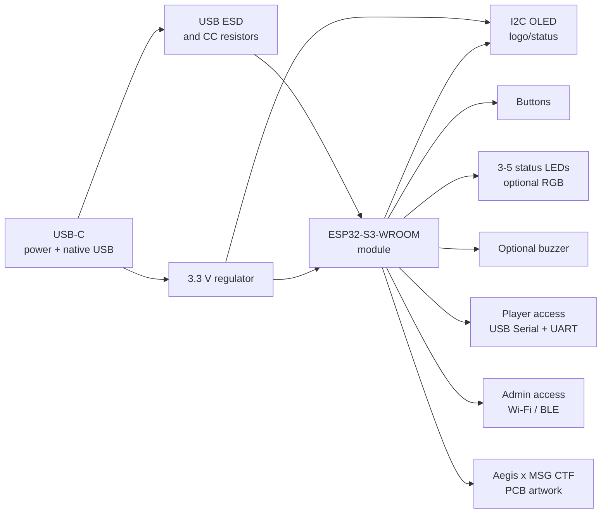

# Hacking Box V2-A Design Proposal

> Historical proposal: superseded by the ESP32-S3 Hacking Badge Ver.3
> production files in `hardware/releases/rev3/jlcpcb/`. Do not use the tentative
> GPIO, regulator, or buzzer-DNP entries below for fabrication or firmware.

Status: Pre-schematic design proposal. No schematic or PCB file has been
created.

## Goal

Design a small assembled booth board for the MSG CTF finals Aegis experience
zone. The board should support the "badge hacking" concept, show Aegis branding
on a small display or PCB artwork, and be practical to build as about 10 units
through JLCPCB assembly.

## Recommended Baseline

V2-A should move from an Arduino Nano-compatible ATmega328P design to an
ESP32-S3-WROOM module based design.

Rationale:

- More SRAM and CPU headroom for display UI and challenge logic.
- Native USB Serial/JTAG on `GPIO19` and `GPIO20`, reducing the need for a
  separate USB-to-serial bridge.
- Wi-Fi/BLE can support booth reset, scoring, hints, or hidden challenge paths.
- A module reduces RF layout risk compared with a bare ESP32-S3 chip.
- For 10 assembled boards, the ESP32-S3 module cost is noticeable but feasible
  if the design actually uses USB, display, and/or wireless features.

The fallback architecture is RP2350 if wireless is not useful. ATmega328P should
remain a compatibility reference for the old Hacking-Box firmware, not the
preferred V2-A target.

## Proposed Feature Set

| Feature | V2-A Proposal | Notes |
| --- | --- | --- |
| MCU | ESP32-S3-WROOM module | Prefer JLCPCB/LCSC stocked module variant. |
| Logic voltage | 3.3 V | Native for ESP32-S3 and most modern displays. |
| USB | USB-C device port | Power, firmware upload, serial console, and staff recovery. |
| Display | 128x64 I2C OLED connector or module footprint | Start with logo/status UI; avoid color TFT in first spin. |
| User input | 2-3 tactile buttons | Menu/action/reset-like challenge interactions. |
| Status output | 3-5 challenge status LEDs plus optional RGB LED | Show problem progress, solve state, and booth-visible feedback. |
| Audio | Optional small buzzer footprint | Useful for feedback; can be DNP if budget/space is tight. |
| Player interface | USB Serial plus exposed UART pads | Player-facing access should stay wired and challenge-scoped. |
| Admin interface | Wi-Fi/BLE management channel | Staff-only status, reset, provisioning, and event control. |
| Challenge pads | Exposed labeled UART/GPIO/test pads | Intentional hacking surface with series resistors where useful. |
| Recovery | USB boot/reflash plus EN and BOOT buttons/pads | Staff must be able to recover boards quickly. |
| Artwork | Aegis shield outline plus `Aegis x MSG CTF` | Black solder mask with white silkscreen as the first-spin visual direction. |
| Power | USB 5 V input to 3.3 V regulator | Battery is not included in V2-A unless separately approved. |

## Block Diagram

## Board Concept

- Aegis shield-inspired board outline, roughly palm size.
- Black solder mask and white silkscreen are the target visual stackup.
- Top side: OLED near upper center, Aegis logo/artwork visible, buttons reachable
  with one hand.
- USB-C on an edge with enough mechanical clearance for repeated cable use.
- ESP32-S3-WROOM placed near a board edge with antenna keep-out respected.
- Challenge pads grouped and labeled clearly enough for participants, but not so
  verbose that the board gives away the solution.
- Staff recovery pads/buttons placed away from the main participant interaction
  area.
- Prefer single-sided SMT assembly for cost control.
- Keep the shield outline manufacturable with straight or gently segmented
  edges; avoid overly detailed logo curves on the first spin.

## Proposed Electrical Architecture

### USB And Power

- USB-C receptacle configured as a USB 2.0 device.
- `VBUS` feeds a 3.3 V regulator.
- USB D- and D+ connect to ESP32-S3 `GPIO19` and `GPIO20`.
- Add USB ESD protection and follow Espressif USB routing guidance.
- Include `EN` reset and `GPIO0` boot access for recovery.

### ESP32-S3 Module

- Use ESP32-S3-WROOM module rather than bare ESP32-S3 chip.
- Avoid assigning normal features to strapping pins unless deliberately designed:
  `GPIO0`, `GPIO3`, `GPIO45`, and `GPIO46`.
- Avoid flash/PSRAM-reserved pins for module variants that use embedded
  flash/PSRAM.
- Respect module antenna keep-out.

### Display

- First-spin recommendation: 128x64 I2C OLED.
- Put the Aegis logo bitmap in firmware assets.
- If using a connector, make it easy to hand-solder the OLED after JLCPCB
  assembly.
- If using an assembled module/part, confirm JLCPCB availability before locking
  the footprint.

### Challenge Interface

- Expose a small set of intentional challenge pads:
  - UART TX/RX or alternate serial challenge port.
  - Several GPIO pads with current-limiting or series resistors.
  - Ground and 3.3 V reference pads.
- Do not expose raw USB, regulator feedback, or fragile module pins as the main
  challenge surface.
- Player-facing firmware should expose only the intended USB Serial and UART
  challenge commands.
- I2C should remain internal by default because the OLED shares that bus; expose
  it only if the challenge explicitly needs I2C.

### Admin Wireless Management

- ESP32-S3 Wi-Fi/BLE can provide a staff-only management path.
- Candidate admin actions:
  - Read board ID, firmware version, power state if available, and current
    challenge state.
  - Reset challenge progress.
  - Put a board into demo, idle, or player mode.
  - Push simple hints/status messages to the OLED.
  - Trigger a staff recovery mode before USB reflashing.
- Keep admin commands separate from the USB Serial/UART command parser.
- Require an admin unlock mechanism, such as a per-board token, shared event
  secret, or physical staff button long-press.
- Prefer disabling or hiding wireless management during active player attempts
  unless the event flow needs live monitoring.
- OTA updates are possible but should not be required for first-spin booth
  recovery; USB recovery should remain available.

## Tentative V2-A Pin Plan

This is not final. It is a starting point for schematic capture after approval.

| Signal | ESP32-S3 GPIO | Purpose | Notes |
| --- | --- | --- | --- |
| `USB_D-` | `GPIO19` | Native USB D- | Fixed by ESP32-S3 USB guidance. |
| `USB_D+` | `GPIO20` | Native USB D+ | Fixed by ESP32-S3 USB guidance. |
| `BOOT` | `GPIO0` | Download boot strap | Button or pad; do not use as challenge GPIO. |
| `EN` | `EN` | Reset/chip enable | Button or pad for staff recovery. |
| `OLED_SDA` | `GPIO4` | I2C display data | 3.3 V pull-ups. |
| `OLED_SCL` | `GPIO5` | I2C display clock | 3.3 V pull-ups. |
| `BTN_A` | `GPIO10` | Deferred user/challenge button | DNP in cost-first first spin unless V1 requires it. |
| `BTN_B` | `GPIO11` | Deferred user/challenge button | DNP in cost-first first spin unless V1 requires it. |
| `STATUS_LED_0` | `GPIO13` | Challenge status LED | Current-limited; stage/progress indicator. |
| `STATUS_LED_1` | `GPIO14` | Challenge status LED | Current-limited; stage/progress indicator. |
| `STATUS_LED_2` | `GPIO15` | Challenge status LED | Current-limited; stage/progress indicator. |
| `STATUS_LED_3` | `GPIO16` | Challenge status LED | Current-limited; stage/progress indicator. |
| `STATUS_LED_4` | `GPIO17` | Challenge status LED | Current-limited; stage/progress indicator. |
| `BUZZER` | `GPIO18` | Deferred PWM output | DNP in cost-first first spin. |
| `CHAL_0` | `GPIO6` | Challenge pad | Add 1 kOhm series resistor. |
| `CHAL_1` | `GPIO7` | Challenge pad | Add 1 kOhm series resistor. |
| `CHAL_2` | `GPIO8` | Challenge pad | Add 1 kOhm series resistor. |
| `UART_TX` | `GPIO43` | Player serial TX | Exposed pad through 1 kOhm series resistor. |
| `UART_RX` | `GPIO44` | Player serial RX | Exposed pad through 1 kOhm series resistor. |
| `ADMIN_UNLOCK` | `GPIO12` | Physical admin unlock | Hidden active-low button. |

## Cost Control Rules

- Use single-sided SMT unless the board outline or display forces otherwise.
- Keep unique Extended parts low.
- Prefer JLCPCB Basic resistors/capacitors.
- Consider hand-soldering the display module and any large decorative connector.
- Avoid unnecessary USB-to-serial bridge if native USB is used.
- Avoid battery charging in the first spin unless the event flow requires it.

## Remaining Items Before Final Schematic/PCB Release

- ESP32-S3-WROOM-1-N8R8 (`C2913201`) is the current cost-first controller
  baseline.
- USB-only power is the current first-spin baseline.
- OLED is a hand-soldered 0.96 inch SSD1306-compatible I2C module via 4-pin
  connector/pads.
- Wi-Fi/BLE is staff/admin management only by default.
- Decide challenge pad count and intended solve path.
- Status LED count is approved as 5 indicators.
- Approximate board outline is now a rounder Aegis shield draft; final outline
  still needs review after real footprints are placed.
- Confirm whether the old Hacking-Box firmware will be ported or rewritten.
